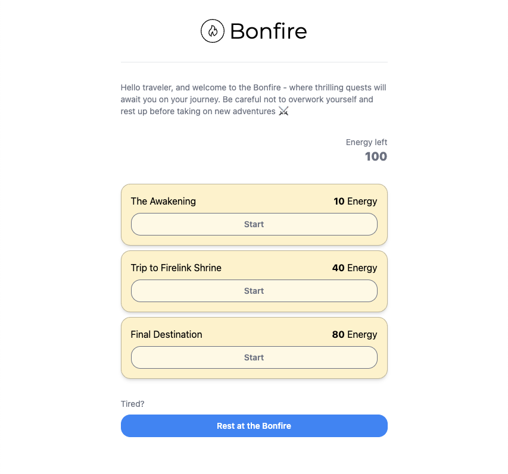

#  Bonfire

## Context

Bonfire is the interview exercise for Frontend-related engineer roles at [APWine](https://apwine.fi/).

It is a simple application built with [Next.js](https://nextjs.org/), [Tailwind CSS](https://tailwindcss.com/), [web3-react](https://github.com/Uniswap/web3-react) and [TanStack Query](https://tanstack.com/) among other technologies. _No knowledge of Web3 is required to complete the exercise._



The Figma file for the application can be found [on this page](https://www.figma.com/file/FwStKLIFvrCfQ9rvaS1sjm/Untitled?node-id=0%3A1&t=E0IzdajTFCvee8u9-1).

### The App

You are an adventurer on a journey to complete three different quests.
The application consists of a single page that displays the list of available quests. You can complete a quest by clicking on the "Start" button. To complete quests, you will need to have enough energy, which is stored in a smart contract on the blockchain (think of it as a database + API on Ethereum). You can refill your energy by resting at the Bonfire. Any action you take will be a transaction on the blockchain.

### Goal

The application has pieces of code missing. Your goal is to complete the application by filling in the missing pieces of code. You can find the missing pieces by searching for the following comments:

```ts
/* TODO: ... */
```

## Setup

### Prerequisites

You will need:

-   [Node.js](https://nodejs.org/en/)
-   [Yarn](https://yarnpkg.com/)
-   An [Alchemy](https://alchemyapi.io/) API key - see [here](https://docs.alchemyapi.io/guides/quickstart) for instructions on how to get one
-   A Web3 wallet (e.g. [MetaMask](https://metamask.io/)) connected to the [Goerli test network](https://blog.cryptostars.is/goerli-g%C3%B6rli-testnet-network-to-metamask-and-receiving-test-ethereum-in-less-than-2-min-de13e6fe5677), along with some [test ETH](https://goerlifaucet.com/)

### Installation

1. Clone the repository: `git clone https://github.com/APWine/frontend-exercise-public && cd frontend-exercise-public`
2. Install dependencies: `yarn`
3. Copy the `.env.example` file to `.env` and fill in your Alchemy API key
4. Generate contract typings: `yarn gen:typechain`
5. Start the development server: `yarn dev`

## Exercises

The whole project should take you about an hour to complete. For each exercise, you are free to create any additional types, props, components, files, etc. as you see fit.

### 1. `Button` component

Implement the Button component in `components/Button.tsx`. The props are already defined, but the component is not implemented. You should take reference from the Figma design.

### 2. First steps with `useWallet`

Take a look at how the `useWallet` hook works and display either the connect wallet page or the home page in `pages/index.tsx`.

### 3. Implement data fetching queries

Now is time to load data from the blockchain. Implement the queries in `useCompletedQuestsQuery.ts`, `useEnergyLeftQuery.ts`, and `useQuestsQuery.ts`.

_Hints:_

1. Some data, such as completed quests, is associated to a specific user/account. You'll need to handle the scenario where the user changes their account in their wallet.
2. You can use the `useBonfire` hook to retrieve the smart contract. It contains all methods you need to interact with it.
3. For the `useCompletedQuests` query, you will need to do multiple calls to the smart contract. Fortunately, you can batch all calls into one using a `Promise.all` containing all fetch promises, then return the entire array.

### 4. Implement the Bonfire resting functionality

Implement the `BonfireRestButton` component in `components/BonfireRestButton.tsx`. It should call the `rest` method on the smart contract when clicked. If the user does not need energy, the button should be disabled.

_Hints:_

1. For success and error handling, you can use the `toast.promise` method from [react-hot-toast](https://react-hot-toast.com/), which takes a promise.
2. You will need to connect the bonfire contract to the user signer. You can find the signer in `useWallet` and connect the contract to it using `.connect(signer)`.
3. A success message should display when the transaction is **confirmed on the blockchain**. You can use `tx.wait()` to wait for the transaction to be confirmed. The `tx` object is returned when calling smart contract methods.

### 5. Quest Card

Now you're on your own! Combine all your knowledge to finish the application. The final step is to implement the `QuestCard` component in `components/QuestCard.tsx`. It should display the quest data and allow the user to start the quest. When the user clicks on the "Start" button, the `completeQuest` method should be called on the smart contract. Depending on whether the quest is completed and whether the user has enough energy, the card should change its background color and hide the "Start" button.

Proceed with success and error handling in the same way as the previous step.

### Stretch Goals

If you've completed the exercise, you can try to implement the following:

-   Animations
-   Custom styling
-   Code refactoring. How would you make it more efficient?

### Submission

Please submit your solution as a link to a public GitHub repository. If you have any questions, please contact us at [jobs@apwine.fi](mailto:jobs@apwine.fi).
